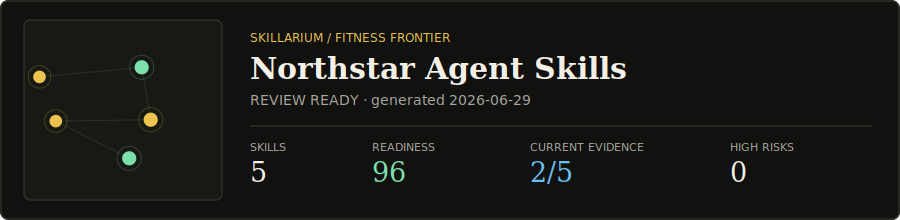

# Skillarium

**A GitHub-native fitness frontier for AI agent skills.**

Skillarium scans a mixed Codex, Claude Code, and Agent Skills repository, separates static readiness from real evaluation evidence, and publishes a clickable constellation plus a README-ready SVG card.

[](./docs/demo/)

> A skill can be beautifully written and still be untested. Skillarium never turns static linting into a fake quality claim.

## The Product Rule

Skillarium reports two independent signals:

| Signal | What it proves |
| --- | --- |
| **Readiness** | The skill is structurally valid, discoverable, portable, internally linked, and reviewable. |
| **Evidence** | A benchmark receipt matches the exact current skill digest and evaluation criteria. |

A repository becomes green only when its skills are ready, its evidence is current and strong, and no high-severity static risk is present.

## Quick Start

Requires Node.js 20 or newer.

```bash
npx skillarium init
npx skillarium build
```

Open:

```text
.skillarium/site/index.html
```

`init` adds `.skillarium.yml` and a GitHub Actions workflow. `build` generates:

```text
.skillarium/site/
  index.html
  manifest.json
  card.svg
  card-dark.svg
```

Until the first npm release, run from source:

```bash
npm install
npm run build
node dist/cli.js build --root examples/team-skills --out-dir ../../docs/demo
```

## Share It

GitHub READMEs cannot run the interactive observatory, so Skillarium generates a live-looking static card that links to the GitHub Pages experience:

```html
<a href="https://OWNER.github.io/REPO/">
  <picture>
    <source media="(prefers-color-scheme: dark)" srcset="https://OWNER.github.io/REPO/card-dark.svg">
    
  </picture>
</a>
```

Every repository using Skillarium becomes a distribution surface: card view, observatory click, then another repository can run `skillarium init`.

## Supported Skill Locations

The default scanner looks only inside the current repository:

```text
skills/**/SKILL.md
.agents/skills/**/SKILL.md
.codex/skills/**/SKILL.md
.claude/skills/**/SKILL.md
```

It never scans a home directory or executes skill code implicitly. Explicit files and directories are also supported:

```bash
npx skillarium scan ./team-skills ./special/SKILL.md
npx skillarium build ./team-skills --out-dir ./public
```

## CLI

| Command | Result |
| --- | --- |
| `skillarium init` | Creates config and a Pages workflow without overwriting existing files. |
| `skillarium scan [paths...]` | Emits the versioned JSON manifest. |
| `skillarium build [paths...]` | Generates the manifest, light/dark SVG cards, and observatory. |
| `skillarium build --fail-on high` | Exits non-zero for high or critical risk in CI. |

Use `--force` only with `init` when generated setup files should be replaced.

## Readiness Checks

The first release uses deterministic checks rather than an LLM judge:

- Parseable YAML frontmatter.
- Valid lowercase kebab-case name.
- Description length and an explicit `Use when` activation cue.
- Skill name and directory agreement.
- Actionable instruction body.
- Resolved local Markdown links.
- No machine-specific absolute paths.
- Progressive disclosure for long instruction files.
- Static flags for destructive shell, credential access, networking, package installation, and git mutation.

Each deduction is visible in the Readiness Ledger. Risk patterns are surfaced separately and do not pretend to be a malware verdict.

## Evidence Receipts

External test harnesses can write JSON receipts into `.skillarium/evidence/`:

```json
{
  "schemaVersion": 1,
  "skillId": "skill-installer",
  "skillDigest": "4bc285da0ee4fd2a",
  "criteriaDigest": "install-safety-v1",
  "runAt": "2026-06-29T12:00:00.000Z",
  "cases": 12,
  "passed": 12,
  "source": {
    "name": "team benchmark",
    "url": "https://github.com/OWNER/REPO/actions/runs/123"
  }
}
```

Changing `SKILL.md` changes its digest, immediately turning old evidence stale. Changing evaluation criteria creates a new `criteriaDigest`, preventing unrelated scores from being presented as one continuous streak.

Public schemas:

- [`manifest.schema.json`](./schema/manifest.schema.json)
- [`evidence.schema.json`](./schema/evidence.schema.json)

## Configuration

```yaml
version: 1
title: My Team Skill Observatory
include:
  - skills/**/SKILL.md
  - .agents/skills/**/SKILL.md
exclude:
  - "**/node_modules/**"
outputDir: .skillarium/site
evidenceDir: .skillarium/evidence
failOn: critical
overrides:
  market-scan:
    channel: beta
    tags: [research, strategy]
```

Per-skill metadata can also be stored without changing the core Agent Skills fields:

```yaml
metadata:
  skillarium:
    channel: stable
    tags: [support, operations]
```

## Why This Shape

Skillarium is influenced by three important ideas:

- [Andrej Karpathy's autoresearch](https://github.com/karpathy/autoresearch) demonstrates a constrained experiment loop: modify, measure against a fixed harness, then keep or revert. Future Skillarium evolution PRs will follow that discipline.
- [Shreya Shankar's criteria-drift research](https://x.com/sh_reya/status/1782425962246033436) shows why an evaluator must remain aligned with user-defined good and bad outputs. Skillarium therefore versions evidence criteria.
- [SkillLens](https://microsoft.github.io/SkillLens/) and [SkillOpt](https://microsoft.github.io/SkillOpt/) treat skills as lifecycle artifacts whose actual effect must be measured across extraction, consumption, validation, and transfer.

Skillarium is an independent open-source project. These references are inspiration and research grounding, not endorsement or affiliation.

## Where It Fits

| Tool shape | Primary job |
| --- | --- |
| Skill registries and installers | Discover and copy skills. |
| Harness-specific health commands such as [GSD skill health](https://github.com/gsd-build/gsd-2/blob/main/docs/user-docs/skills.md) | Measure usage inside one execution harness. |
| Optimizers such as [Darwin Skill](https://github.com/alchaincyf/darwin-skill) | Improve one skill through scored revisions. |
| **Skillarium** | Publish a cross-agent repository-level readiness, evidence, risk, and release map. |

## Current Scope

Version `0.1` is intentionally local-first and non-executing:

- Real repository scanner.
- Versioned manifest and evidence receipt schemas.
- Deterministic readiness ledger and static risk surface.
- Light/dark README cards.
- Interactive generated observatory.
- GitHub Pages workflow and CI failure thresholds.

Not included yet:

- Running skills against models.
- Importing Codex or Claude session traces.
- Automatically editing or merging skills.
- Organization authentication, RBAC, or private hosted storage.

## Roadmap

1. Adapters for GSD, SkillOpt, promptfoo, and custom eval outputs.
2. Pull request comparison showing readiness, evidence, and criteria drift.
3. Trace-to-skill proposals with human approval.
4. Karpathy-style bounded evolution branches with immutable held-out evals.
5. Private organization observatories, release channels, audit logs, and SSO.

## Development

```bash
npm install
npm run verify
node dist/cli.js build --root examples/team-skills --out-dir ../../docs/demo
```

The browser test suite validates desktop and mobile Chrome layouts, interaction, filtering, and horizontal overflow.

## Contributing

Read [CONTRIBUTING.md](./CONTRIBUTING.md). Good first contributions include another ecosystem fixture, a new deterministic readiness check, or an evidence adapter backed by a real test format.

## Security

Skillarium statically reads skill files and writes generated output. It does not execute discovered scripts. See [SECURITY.md](./SECURITY.md) for reporting and trust boundaries.

## License

[MIT](./LICENSE)
